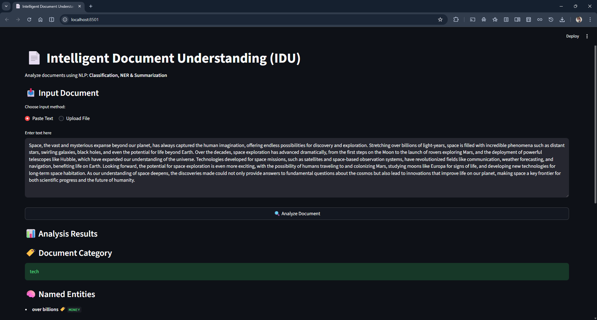
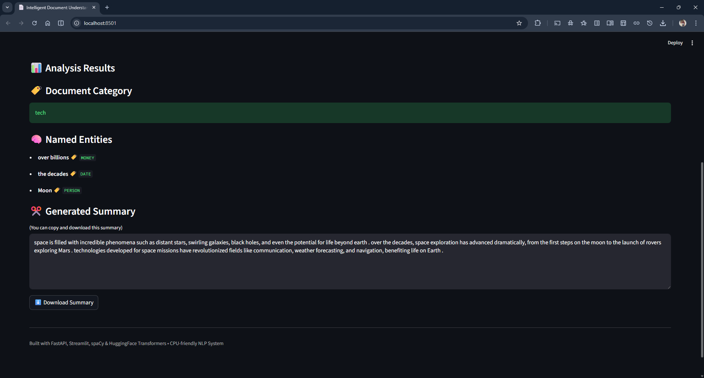

# 📄 Intelligent Document Understanding (IDU) – NLP System

An **end-to-end NLP application** that analyzes unstructured documents using **Machine Learning and Deep Learning models**, providing:

* 📌 Document Classification
* 🧠 Named Entity Recognition (NER)
* ✂️ Abstractive Text Summarization

Built with **FastAPI (backend)**, **Streamlit (frontend)**, **spaCy**, and **HuggingFace Transformers**, optimized for **CPU-only execution**.

---

## 🚀 Key Features

* 🔍 Predicts document category (Business, Tech, Sports, etc.)
* 🧠 Extracts named entities (ORG, GPE, DATE, etc.)
* ✂️ Generates abstractive summaries using Transformer models
* 🌐 REST API using FastAPI
* 🖥️ Interactive UI using Streamlit
* 📄 Supports **text input and file upload (TXT, PDF)**
* 🧪 Modular notebooks for training, evaluation, and integration

---

## 🖼️ Application Demo

Below screenshots demonstrate the working Streamlit-based Intelligent Document Understanding system.

### 🔹 Streamlit Interface – Input & Results

- Supports text paste and document upload (TXT / PDF)
- Performs document classification
- Extracts named entities (NER)
- Generates an automatic summary
- Copy and Download the summary



[See Download Summary](assets/summary.txt)


---

## 🗂️ Project Structure

```
Intelligent-Document-Understanding/
│
├── app/
│   └── main.py
│
├── assets/
│   ├── streamlit_input.png
│   ├── streamlit_results.png
│   └── summary.txt
│
├── data/
│   └── bbc-news-data.csv
│
├── models/
│   ├── text_classifier.pkl
│   └── tfidf_vectorizer.pkl
│
├── notebooks/
│   ├── 01_data_understanding.ipynb
│   ├── 02_text_preprocessing.ipynb
│   ├── 03_text_classification.ipynb
│   ├── 04_ner.ipynb
│   ├── 05_summarization.ipynb
│   └── 06_integration_testing.ipynb
│
├── streamlit_app.py
├── requirements.txt
├── README.md
└── .gitignore

```

---

## 🔄 System Workflow

```
Input Document
      ↓
Text Preprocessing
      ↓
Document Classification
      ↓
Named Entity Recognition
      ↓
Text Summarization
      ↓
API Response → Streamlit UI
```

---

## 🧪 Datasets Used

* **BBC News Dataset**

  * Used for document classification
  * Categories: Business, Politics, Tech, Sports, Entertainment

> NER is performed using **spaCy pre-trained models**
> Summarization uses **HuggingFace transformer models**

---

## ⚙️ Installation & Setup

### 1️⃣ Create virtual environment

```bash
python -m venv venv
```

Activate it:

```bash
# Windows
venv\Scripts\activate

# Linux / Mac
source venv/bin/activate
```

---

### 2️⃣ Install dependencies

```bash
pip install -r requirements.txt
```

Download spaCy model:

```bash
python -m spacy download en_core_web_sm
```

---

## ▶️ Running the Application

### 🔹 Terminal 1 — Start FastAPI backend

```bash
uvicorn app.main:app --reload
```

Backend runs at:

```
http://127.0.0.1:8000
```

---

### 🔹 Terminal 2 — Start Streamlit frontend

```bash
streamlit run streamlit_app.py
```

UI opens at:

```
http://localhost:8501
```

---

## 🖥️ Application Capabilities

### ✔ Input Methods

* Paste raw text
* Upload `.txt` or `.pdf` files

### ✔ Output

* 🏷️ Predicted document category
* 🧠 Extracted named entities
* ✂️ Generated abstractive summary

---

## 🧠 Models Used

| Task           | Model                                |
| -------------- | ------------------------------------ |
| Classification | TF-IDF + Logistic Regression         |
| NER            | spaCy `en_core_web_sm`               |
| Summarization  | T5-small (CPU-optimized Transformer) |

---

## 📊 Evaluation Strategy

* **Classification**: Accuracy, Precision, Recall, F1-score
* **NER**: Qualitative inspection of extracted entities
* **Summarization**: Human qualitative evaluation
  *(coherence, coverage, factual consistency)*

> This mirrors **real-world industry evaluation practices** for NLP systems.

---

## 🧩 Why This Project Matters

✔ Demonstrates **end-to-end ML system design**
✔ Covers **NLP + APIs + UI integration**
✔ Modular, production-oriented architecture
✔ Resume-ready project for **ML Engineer / NLP Engineer roles**

---

## 🔮 Future Enhancements

* Docker containerization
* CI/CD using GitHub Actions
* Cloud deployment (AWS / GCP / Azure)
* Model monitoring & logging
* Authentication & rate limiting

---

## 👤 Author

**Sahil Dervankar**
B.Tech CSE(AI ML) | Aspiring ML / NLP Engineer

---

## ⭐ If you like this project

Give it a ⭐ on GitHub — it really helps!

---

