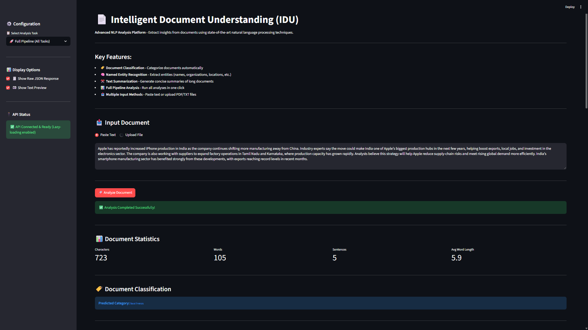
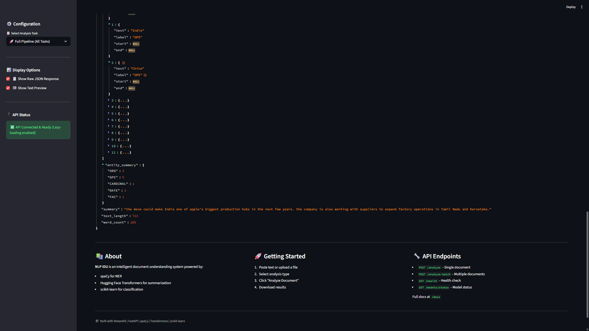

# 📄 Intelligent Document Understanding (IDU) — NLP

An end-to-end NLP application that processes unstructured documents to provide:

- Document classification
- Named Entity Recognition (NER)
- Abstractive text summarization

The project demonstrates an integrated ML workflow with a FastAPI backend and a Streamlit frontend, using spaCy and HuggingFace Transformers. It is designed to run on CPU-only systems.

---

**Project Goal**: Build a modular, reproducible pipeline for extracting structure and concise summaries from documents, suitable for experimentation and demonstration of production-oriented NLP components.

---

## Key Features

- Predict document category (e.g., Business, Tech, Sports)
- Extract entities (ORG, GPE, DATE, PERSON, etc.) using spaCy
- Produce abstractive summaries with Transformer models (HuggingFace)
- Expose functionality via a REST API (FastAPI)
- Interactive Streamlit UI for upload, preview, and results
- Supports text paste and file upload (TXT, PDF)
- Notebooks for data exploration, training, and evaluation

---

## 🖼️ Application Demo

Below screenshots demonstrate the working Streamlit-based Intelligent Document Understanding system.

### 🔹 Streamlit Interface – Input & Results

- Supports text paste and document upload (TXT / PDF)
- Performs document classification
- Extracts named entities (NER)
- Generates an automatic summary
- RAW JSON response
- Copy and Download the summary




[See Download Summary](assets/summary.txt)

---

## Quick Start

1. Create and activate a virtual environment:

```bash
python -m venv venv
# Windows
venv\Scripts\activate
# macOS / Linux
source venv/bin/activate
```

2. Install dependencies:

```bash
pip install -r requirements.txt
```

3. Download the spaCy English model:

```bash
python -m spacy download en_core_web_sm
```

4. Run the backend (FastAPI):

```bash
uvicorn app.main:app --reload
```

5. Run the frontend (Streamlit):

```bash
streamlit run streamlit_app.py
```

Backend default URL: http://127.0.0.1:8000

Streamlit UI default URL: http://localhost:8501

---

## Project Structure 

```
Intelligent-Document-Understanding/
│
├── app/
│   └── main.py
│
├── assets/
│   ├── 1_streamlit_ui.png
│   ├── 2_streamlit_ui.png
│   ├── 3_streamlit_ui.png
│   └── IDU_summary.txt
│
├── data/
│   └── bbc-news-data.csv
│
├── models/
│   ├── text_classifier.pkl
│   └── tfidf_vectorizer.pkl
│
├── notebooks/
│   ├── 01_data_understanding.ipynb
│   ├── 02_text_preprocessing.ipynb
│   ├── 03_text_classification.ipynb
│   ├── 04_ner.ipynb
│   ├── 05_summarization.ipynb
│   └── 06_integration_testing.ipynb
│
├── src/                          # Core NLP pipeline
│   │
│   ├── components/              # Reusable NLP components
│   │   ├── __init__.py
│   │   ├── data_ingestion.py
│   │   ├── data_transformation.py
│   │   ├── feature_engineering.py
│   │   ├── model_trainer.py
│   │   ├── model_evaluation.py
│   │   └── summarization.py
│   │
│   ├── pipeline/                # Training & inference pipelines
│   │   ├── __init__.py
│   │   ├── training_pipeline.py
│   │   └── prediction_pipeline.py
│   │
│   ├── __init__.py
│   ├── exception.py
│   ├── logger.py
│   └── utils.py
├── streamlit_app.py
├── requirements.txt
├── README.md
└── .gitignore

```

Refer to the `src/` and `notebooks/` folders for implementation details and experiments.

---

## 🔄 System Workflow

```
Input Document
      ↓
Text Preprocessing
      ↓
Document Classification
      ↓
Named Entity Recognition
      ↓
Text Summarization
      ↓
API Response → Streamlit UI
```

---

## Models and Data

- Classification: TF-IDF + Logistic Regression (training notebooks included)
- NER: spaCy `en_core_web_sm` 
- Summarization: T5-based model (HuggingFace; CPU-optimized weights stored under `models/`)
- Dataset: BBC News dataset used for classification experiments

---

## Evaluation

- Classification: accuracy, precision, recall, F1
- NER: qualitative inspection and spot checks
- Summarization: ROUGE (automated) and human evaluation for coherence and faithfulness

---

## Development notes

- The codebase is modular to allow replacing models or components.
- Notebooks provide step-by-step experiments used to produce the artifacts in `models/` and `artifacts/`.

If you plan to retrain models or run heavy experiments, consider using a machine with a GPU and updating `requirements.txt` accordingly.

---

## 🔮 Future Enhancements

- Docker containerization
- CI/CD using GitHub Actions
- Cloud deployment (AWS / GCP / Azure)
- Model monitoring & logging
- Authentication & rate limiting

---

## Author

Sahil Dervankar — Aspiring ML / NLP Engineer

---

## ⭐ If you like this project

Give it a ⭐ on GitHub — it really helps!

